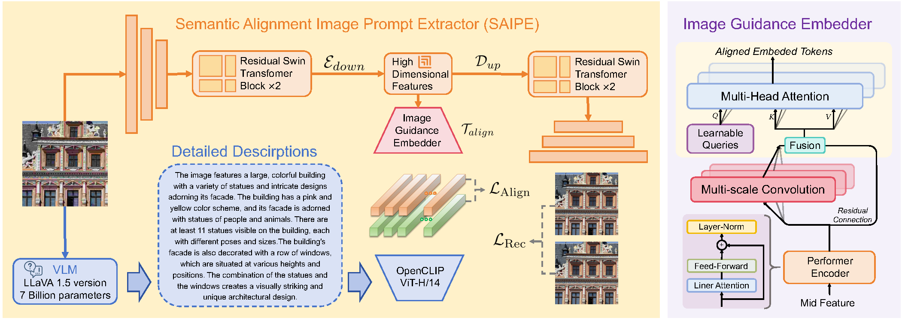
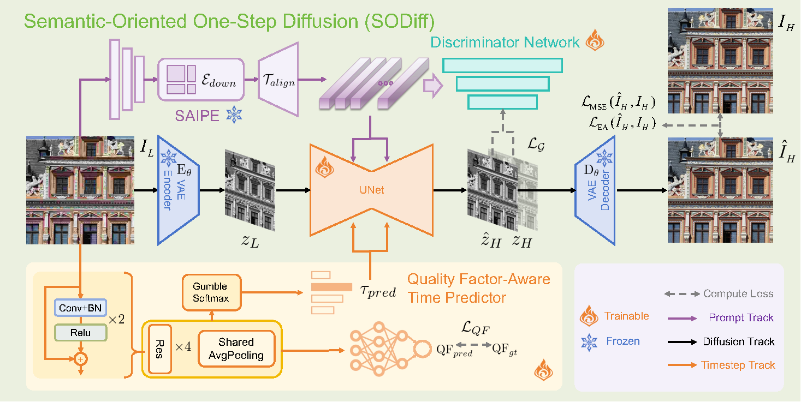
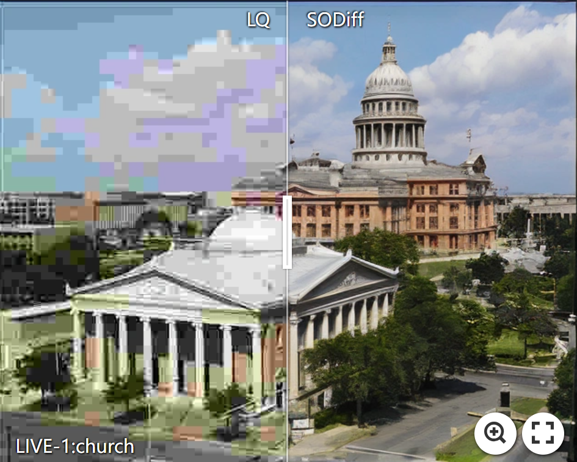
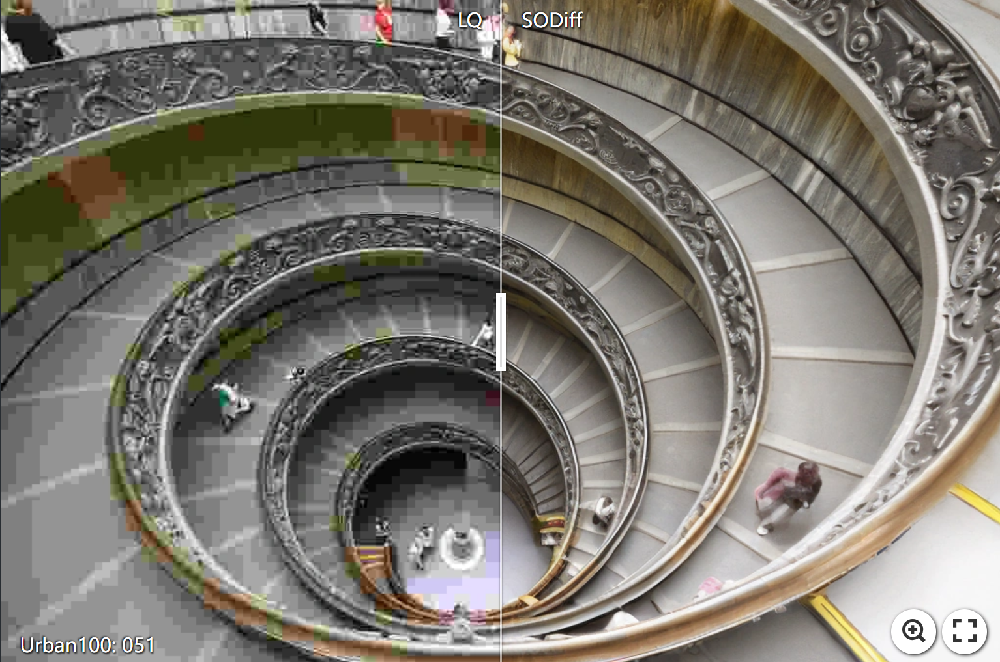
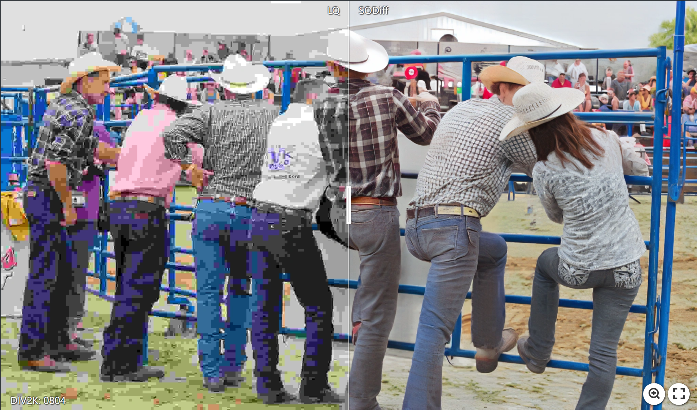
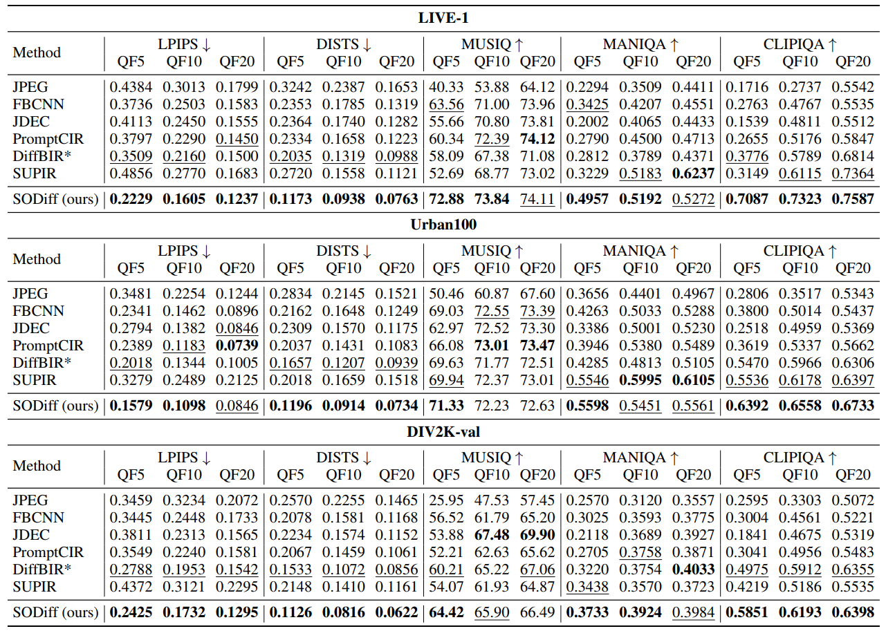

<h1 align="center">
  SODiff: Semantic-Oriented Diffusion Model <br>
  for JPEG Compression Artifacts Removal 
</h1>

<p align="center">
  <a href="https://arxiv.org/abs/2508.07346">
    
  </a>
  <a href="https://github.com/frakenation/SODiff/releases/download/Paper/supp.pdf">
    
  </a>
  <a href="https://github.com/frakenation/SODiff/releases">
    
  </a>
  <a href="https://github.com/frakenation/SODiff">
    
  </a>
  <a href="https://github.com/frakenation/SODiff">
    
  </a>
</p>


#### 🔥🔥 News

- **2025-08-10:** This repo is released.
---

> **Abstract:** JPEG, as a widely used image compression standard, often introduces severe visual artifacts when achieving high compression ratios. Although existing deep learning-based restoration methods have made considerable progress, they often struggle to recover complex texture details, resulting in over-smoothed outputs. To overcome these limitations, we propose SODiff, a novel and efficient semantic-oriented one-step diffusion model for JPEG artifacts removal. Our core idea is that effective restoration hinges on providing semantic-oriented guidance to the pre-trained diffusion model, thereby fully leveraging its powerful generative prior. To this end, SODiff incorporates a semantic-aligned image prompt extractor (SAIPE). SAIPE extracts rich features from low-quality (LQ) images and projects them into an embedding space semantically aligned with that of the text encoder. Simultaneously, it preserves crucial information for faithful reconstruction. Furthermore, we propose a quality factor-aware time predictor that implicitly learns the compression quality factor (QF) of the LQ image and adaptively selects the optimal denoising start timestep for the diffusion process. Extensive experimental results show that our SODiff outperforms recent leading methods in both visual quality and quantitative metrics. 

<p align="center">
  <br>
  <b>Figure 1:</b> SAIPE (semantic-aligned image prompt extractor) overview.
</p>

<p align="center">
  <br>
  <b>Figure 2:</b> Model structure of SODiff (semantic-oriented diffusion).
</p>

---

<table>
  <tr>
    <td align="center">
      <a href="https://imgsli.com/NDA2NDk5"></a><br>
      <b>LIVE-1 (QF=5)</b>
    </td>
    <td align="center">
      <a href="https://imgsli.com/NDA2NTA2"></a><br>
      <b>Urban100 (QF=5)</b>
    </td>
    <td align="center">
      <a href="https://imgsli.com/NDA2NTA5"></a><br>
      <b>DIV2K-val (QF=5)</b>
    </td>
  </tr>
</table>

*Click on images to view interactive comparisons on ImgSli.*

</div>

---

## 📋 TODO

* [ ] Release code and pretrained models

## 🔗 Contents

- [ ] Models
- [ ] Testing
- [ ] Training
- [x] [Results](#Results)
- [x] [Citation](#Citation)
- [ ] [Acknowledgements](#Acknowledgements)

## <a name="results"></a>📊 Results
---
The performance of **SODiff** on the datasets **LIVE-1**, **Urban100**, and **DIV2K-val**. Detailed results can be found in the paper.

<details>
<summary>&ensp;Quantitative Comparisons (click to expand) </summary>
<li> Results in the Table below show SODiff's performance on different datasets. 
<p align="center">

</p>
</li>


## <a name="citation"></a>👉 Citation

If you find the work helpful to your research, please cite the following paper(s).

```
@article{Yang2025sodiff,
    title={{SODiff: Semantic-Oriented Diffusion Model for JPEG Compression Artifacts Removal }},
    author={Yang, Tingyu and Gong, Jue and Guo, Jinpei and Li, Wenbo and Guo, Yong and Gu, Hong and Zhang, Yulun},
    journal={arXiv preprint 2508.07346},
    year={2025}
}
```


